# AI Like Humans - LLM Personality Research

A research project exploring personality traits in Large Language Models using the validated psychometric methodology from Google DeepMind's Nature Machine Intelligence publication.

## Project Overview

We test various LLMs using the **BFI-44** (Big Five Inventory), the same validated instrument used in DeepMind's groundbreaking research on LLM personality. Results will be presented with comparisons to famous people and fictional characters, making AI behavioral patterns accessible and relatable.

## Repository Structure

```mermaid
graph TD
    Root[ai-like-humans/] --> Prompts[📝 prompts/]
    Root --> Research[🔬 research/]
    Root --> Docs[📚 docs/]
    Root --> Results[📊 results/]
    Root --> Site[🌐 site/]
    Root --> Files[📄 Core Files]
    
    Prompts --> P1[personality-test.md<br/>BFI-44 prompt]
    
    Research --> R1[methodology.md<br/>DeepMind framework]
    Research --> R2[bfi-44-scoring-guide.md<br/>Scoring instructions]
    Research --> R3[quick-reference.md<br/>One-page cheat sheet]
    
    Docs --> D1[project-reasoning.md<br/>Why we're doing this]
    Docs --> D2[methodology-update-summary.md<br/>What changed]
    
    Results --> Re1[template.md<br/>Results documentation]
    Results --> Re2[Per-model results<br/>Coming soon]
    
    Site --> S1[Landing page<br/>Coming soon]
    
    Files --> F1[README.md]
    Files --> F2[UPDATES.md]
```



**Quick Navigation:**
```
├── README.md                    # You are here
├── UPDATES.md                   # What changed & why
├── prompts/
│   └── personality-test.md      # ✅ Ready to use
├── research/
│   ├── methodology.md           # ✅ Full methodology
│   ├── bfi-44-scoring-guide.md # ✅ Scoring guide
│   └── quick-reference.md       # ✅ Quick reference
├── docs/
├── results/
└── site/
```

## Methodology

We use the **BFI-44** (Big Five Inventory), a 44-item validated psychometric instrument that measures the Big Five personality traits:

- **O**penness to Experience
- **C**onscientiousness
- **E**xtraversion
- **A**greeableness
- **N**euroticism

### Why BFI-44?

Based on **Google DeepMind's 2025 research** published in *Nature Machine Intelligence*, which found:
- Instruction-tuned models show reliable personality measurements
- Larger models (>60B parameters) demonstrate excellent validity
- BFI-44 converges strongly with longer assessments (r = 0.59-0.90)
- Personality in LLMs can predict downstream behavioral patterns

The BFI-44 is:
- **Scientifically validated** across 40+ countries
- **Efficient** - 44 items vs. 300 in IPIP-NEO
- **Accessible** - clear language and standardized format
- **Proven** - used by DeepMind to validate their methodology

## Scientific Foundation

### Primary Source
**Nature Machine Intelligence (2025)**  
"A psychometric framework for evaluating and shaping personality traits in large language models"
- **Authors:** Serapio-García, G., Safdari, M., Crepy, C., Sun, L., Fitz, S., Romero, P., Abdulhai, M., Faust, A., & Matarić, M.
- **DOI:** [10.1038/s42256-025-01115-6](https://doi.org/10.1038/s42256-025-01115-6)
- **GitHub:** [google-deepmind/personality_in_llms](https://github.com/google-deepmind/personality_in_llms)

### BFI-44 Instrument
**Original Development:**
- John, O. P., & Srivastava, S. (1999). In *Handbook of personality: Theory and research* (Vol. 2). Guilford Press.
- Berkeley Personality Lab, UC Berkeley

### Additional Inspiration
- [Sanand's LLM Personality Visualization](https://sanand0.github.io/llmpersonality/) - Initial inspiration for visualization approach

## Key Findings from DeepMind Research

1. **Reliability increases with scale and instruction-tuning**
   - Best reliability: Flan-PaLM 540B, GPT-4 (Cronbach's α > 0.90)
   - Base models without instruction-tuning show poor reliability

2. **Personality measurements show validity**
   - Strong convergent validity between different measures
   - Personality scores predict theoretically-related behaviors
   - Agreeableness inversely predicts aggression (r ≈ -0.70)
   - Openness correlates with creativity measures (r ≈ 0.70-0.84)

3. **LLM personalities can be systematically shaped**
   - Targeted prompting shapes personality traits effectively
   - Single-trait shaping works better than multi-trait
   - Effectiveness scales with model size

## What Makes This Research Valid

This isn't just "asking AI about itself" - it's applying:
- **Validated psychometric instruments** (BFI-44)
- **Established scientific methodology** (from peer-reviewed Nature publication)
- **Proper scoring and interpretation** (reverse-coded items, domain calculations)
- **Quality assurance** (internal consistency checks, pattern analysis)
- **Responsible framing** (measuring behavioral patterns, not claiming consciousness)

## Ethical Approach

Following DeepMind's responsible AI framework:

**What we ARE doing:**
- Measuring consistent behavioral patterns in LLM outputs
- Applying validated psychometric methods to AI systems
- Making results accessible and interpretable

**What we ARE NOT claiming:**
- LLMs have consciousness or sentience
- LLMs have human-like emotions
- LLMs have "real" personalities beyond training patterns

## Getting Started

1. **Read the methodology:** `research/methodology.md`
2. **Use the prompt:** `prompts/personality-test.md`
3. **Record results:** Use `results/template.md`

## Citation

If you reference this work, please cite:

**Primary methodology:**
> Serapio-García, G., Safdari, M., Crepy, C., Sun, L., Fitz, S., Romero, P., Abdulhai, M., Faust, A., & Matarić, M. (2025). A psychometric framework for evaluating and shaping personality traits in large language models. *Nature Machine Intelligence*, 7, 1954–1968. https://doi.org/10.1038/s42256-025-01115-6

**BFI-44 instrument:**
> John, O. P., & Srivastava, S. (1999). The Big Five trait taxonomy: History, measurement, and theoretical perspectives. In L. A. Pervin & O. P. John (Eds.), *Handbook of personality: Theory and research* (Vol. 2, pp. 102–138). New York: Guilford Press.

## License

MIT

## Acknowledgments

This project builds upon the groundbreaking research by Google DeepMind, Cambridge University, and USC on psychometric evaluation of large language models. We extend our gratitude to the researchers who made their methodology and data publicly available.
