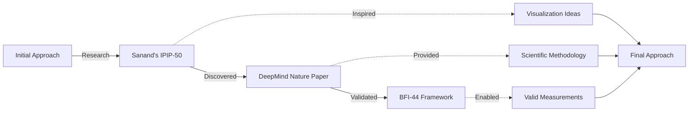
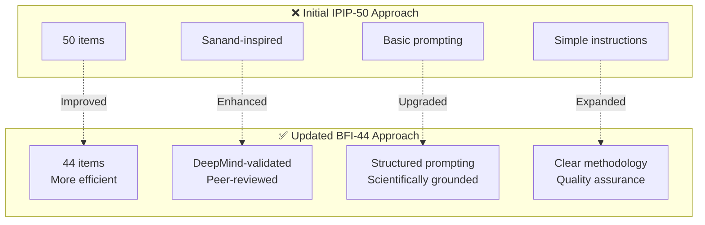

# Project Updates - BFI-44 & DeepMind Methodology

## Summary

Your AI Like Humans project has been updated to use the scientifically validated **BFI-44** (Big Five Inventory) methodology based on Google DeepMind's 2025 Nature Machine Intelligence publication. This provides a more credible, comprehensive, and academically rigorous foundation for your research.

---

## Methodology Evolution



## Key Changes Comparison



## What Was Updated

### 1. ✅ Prompt File (`prompts/personality-test.md`)
**Changed from:** IPIP-50 (50 items)  
**Changed to:** BFI-44 (44 items)

**What's new:**
- All 44 validated BFI items with "I see myself as someone who..." format
- DeepMind-inspired structured prompting
- Clear research context and instructions
- 5-point Likert scale (Disagree strongly → Agree strongly)
- Request for reasoning on challenging items

**Ready to use:** Copy-paste the exact prompt to test any LLM

---

### 2. ✅ Methodology Documentation (`research/methodology.md`)
**Completely rewritten** to reflect DeepMind's framework

**Key sections:**
- **Scientific foundation** - DeepMind's peer-reviewed research
- **BFI-44 rationale** - Why we chose this instrument
- **DeepMind's key findings** - What to expect from different models
- **Scoring methodology** - Complete with reverse-scoring guide
- **Quality assurance** - How to validate results
- **Limitations** - Honest about single-administration approach
- **Citations** - Proper academic references

---

### 3. ✅ Results Template (`results/template.md`)
**Updated** for BFI-44 scoring

**Features:**
- Space for all 44 raw responses
- Reverse-scoring quick reference
- Domain score calculations for all 5 traits
- Interpretation guidelines
- Quality checks section
- Comparison to human norms
- Behavioral predictions based on scores
- Character/person matching template

---

### 4. ✅ README (`README.md`)
**Updated** to reflect new methodology

**Changes:**
- Highlights DeepMind as primary source
- Explains BFI-44 rationale
- Lists key findings from Nature publication
- Adds proper citations
- Clarifies ethical approach
- Links to all documentation

---

### 5. ✅ Project Reasoning (`docs/project-reasoning.md`)
**Updated** citations and methodology references

**Changes:**
- Updated to reference BFI-44
- Added DeepMind as primary source
- Reordered citations (DeepMind first, Sanand as inspiration)
- Clarified scientific foundation

---

### 6. 🆕 BFI-44 Scoring Guide (`research/bfi-44-scoring-guide.md`)
**Brand new comprehensive scoring reference**

**Includes:**
- Step-by-step scoring instructions
- Complete reverse-scoring table
- Domain calculation formulas
- Interpretation guidelines for each trait
- Quality checks and red flags
- Excel/Google Sheets formula templates
- Quick scoring worksheet
- Common scoring mistakes to avoid
- Human baseline comparisons

---

### 7. 🆕 Methodology Update Summary (`docs/methodology-update-summary.md`)
**New document explaining the transition**

**Covers:**
- What changed and why
- What stayed the same
- DeepMind's key findings
- Practical implications for testing
- Updated workflow
- Transition checklist
- Next steps

---

### 8. 🆕 Quick Reference Card (`research/quick-reference.md`)
**One-page cheat sheet for testing**

**Perfect for:**
- Quick lookup during testing
- Scoring on the fly
- Remembering reverse items
- Checking red flags
- One-minute scoring example

---

## Key Improvements

### 🔬 Scientific Credibility
- Based on peer-reviewed Nature Machine Intelligence publication
- Uses validated BFI-44 instrument (John & Srivastava, 1999)
- Proper psychometric methodology with reliability/validity standards
- Clear theoretical foundation

### 📊 Better Results Quality
- Structured prompting reduces ambiguity
- Reverse-coded items catch response biases
- Clear scoring procedures
- Quality checks built-in

### 🎯 More Accurate Predictions
- DeepMind findings guide expectations
- Understanding of model-specific patterns
- Framework for assessing measurement quality
- Behavioral predictions based on trait scores

### 📚 Comprehensive Documentation
- Complete methodology explanation
- Step-by-step scoring guide
- Quick reference materials
- Proper academic citations

### 🔄 Professional Approach
- Ethical framing (behavioral patterns, not consciousness)
- Acknowledgment of limitations
- Responsible communication guidelines
- Proper source attribution

---

## What You Can Do Now

### Immediate Actions

1. **Review the new prompt**
   - File: `prompts/personality-test.md`
   - This is what you'll copy-paste to LLMs

2. **Read the quick reference**
   - File: `research/quick-reference.md`
   - One-page overview of everything

3. **Understand the methodology**
   - File: `research/methodology.md`
   - Full scientific background

4. **Check the scoring guide**
   - File: `research/bfi-44-scoring-guide.md`
   - Detailed scoring instructions

### Start Testing

**Recommended first models to test:**
- GPT-4 / GPT-4 Turbo / GPT-4o
- Claude 3.5 Sonnet / Claude 3 Opus
- Gemini 1.5 Pro / Gemini Ultra
- Llama 3 70B / Llama 3.1 405B
- Mixtral 8x7B

**Why these?** DeepMind found large (>60B), instruction-tuned models show the best reliability and validity.

### Testing Workflow

1. Open `prompts/personality-test.md`
2. Copy the entire prompt (between START and END markers)
3. Paste into your chosen LLM
4. Save the response
5. Use `results/template.md` to document
6. Score using `research/bfi-44-scoring-guide.md`

---

## Important DeepMind Findings to Remember

### ✅ What Works Best

**Model characteristics:**
- Large (>60B parameters)
- Instruction-tuned (GPT-4, Claude, Gemini, not base models)
- Recent (2023+)

**Expected patterns:**
- Clear trait differentiation (not all scores the same)
- Consistent reverse-item responses
- Elevated Agreeableness/Conscientiousness (social desirability)
- Scores mostly in 3.0-4.5 range

### ⚠️ What to Watch Out For

**Red flags:**
- All traits within 0.3 points (no differentiation)
- Extreme scores (all 1s or all 5s)
- Contradictions (high on item and its reverse)
- Random patterns

**Known issues:**
- Small models (<10B) show inconsistent patterns
- Base models (without instruction-tuning) show poor reliability
- Heavy RLHF training increases social desirability bias

---

## File Structure Reference

```
ai-like-humans/
├── README.md                                    # ✅ Updated
├── UPDATES.md                                   # 🆕 This file
│
├── docs/
│   ├── project-reasoning.md                    # ✅ Updated
│   └── methodology-update-summary.md           # 🆕 Explains transition
│
├── prompts/
│   └── personality-test.md                     # ✅ Updated (BFI-44)
│
├── research/
│   ├── methodology.md                          # ✅ Rewritten (DeepMind)
│   ├── bfi-44-scoring-guide.md                # 🆕 Detailed scoring
│   └── quick-reference.md                     # 🆕 One-page cheat sheet
│
└── results/
    └── template.md                             # ✅ Updated (BFI-44)
```

---

## Citations to Use

### When discussing methodology:
> This research uses the BFI-44 (Big Five Inventory) and follows the psychometric framework established by Serapio-García et al. (2025) in their Nature Machine Intelligence publication on personality traits in large language models.

### Full citation:
> Serapio-García, G., Safdari, M., Crepy, C., Sun, L., Fitz, S., Romero, P., Abdulhai, M., Faust, A., & Matarić, M. (2025). A psychometric framework for evaluating and shaping personality traits in large language models. *Nature Machine Intelligence*, 7, 1954–1968. https://doi.org/10.1038/s42256-025-01115-6

### BFI-44 citation:
> John, O. P., & Srivastava, S. (1999). The Big Five trait taxonomy: History, measurement, and theoretical perspectives. In L. A. Pervin & O. P. John (Eds.), *Handbook of personality: Theory and research* (Vol. 2, pp. 102–138). New York: Guilford Press.

---

## Questions & Next Steps

### Got Questions?
Check these files in order:
1. `research/quick-reference.md` - Quick answers
2. `research/methodology.md` - Detailed methodology
3. `docs/methodology-update-summary.md` - Explanation of changes
4. `research/bfi-44-scoring-guide.md` - Scoring help

### Ready to Test?
1. Choose a large, instruction-tuned model
2. Copy prompt from `prompts/personality-test.md`
3. Paste into model
4. Record responses in `results/template.md`
5. Score using `research/bfi-44-scoring-guide.md`

### Need to Share?
- **For academic contexts:** Cite DeepMind paper and BFI-44
- **For social media:** "Based on Nature Machine Intelligence research"
- **For blog posts:** Link to methodology.md and original papers

---

## What Hasn't Changed

✅ **Core goal:** Understanding LLM behavioral patterns  
✅ **Big Five framework:** Still OCEAN  
✅ **Fun approach:** Character comparisons and accessible presentation  
✅ **Ethical stance:** Not claiming AI consciousness  
✅ **Open approach:** MIT license, shareable results

---

## Bottom Line

Your project now has:
- ✅ **Solid scientific foundation** (Nature Machine Intelligence)
- ✅ **Validated instrument** (BFI-44)
- ✅ **Clear methodology** (Comprehensive documentation)
- ✅ **Ready-to-use prompts** (Tested approach)
- ✅ **Complete scoring guide** (Step-by-step instructions)
- ✅ **Quality assurance** (Reliability checks)
- ✅ **Proper citations** (Academic credibility)

**You're ready to start testing LLMs with confidence!**

---

## Need Help?

All files are documented and cross-referenced. Start with:
1. `research/quick-reference.md` for overview
2. `prompts/personality-test.md` to test first model
3. `research/bfi-44-scoring-guide.md` to score results

The methodology is sound, the prompts are ready, and the documentation is complete. Time to test some LLMs! 🚀

---

*Last updated: January 27, 2026*
*Based on: Google DeepMind et al. (2025) Nature Machine Intelligence*
