# Visual Project Overview

Complete visual guide to the AI Like Humans personality research project.

## 🎯 Project Goal

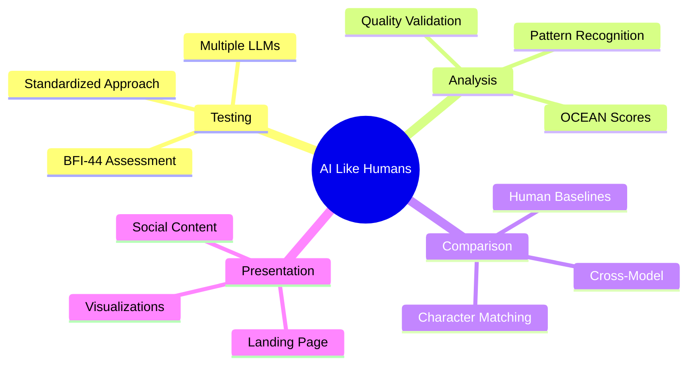

## 📊 Complete Research Pipeline

```mermaid
graph TB
    subgraph Phase1["🔬 Phase 1: Foundation"]
        P1A[Research<br/>DeepMind Paper] --> P1B[Study<br/>BFI-44]
        P1B --> P1C[Document<br/>Methodology]
        P1C --> P1D[Create<br/>Prompt]
    end
    
    subgraph Phase2["🧪 Phase 2: Data Collection"]
        P2A[Select<br/>Models] --> P2B[Administer<br/>BFI-44]
        P2B --> P2C[Record<br/>Responses]
        P2C --> P2D[Validate<br/>Quality]
    end
    
    subgraph Phase3["🧮 Phase 3: Scoring"]
        P3A[Reverse<br/>15 Items] --> P3B[Calculate<br/>5 Domains]
        P3B --> P3C[Check<br/>Consistency]
        P3C --> P3D[Compute<br/>Reliability]
    end
    
    subgraph Phase4["📈 Phase 4: Analysis"]
        P4A[Compare<br/>Models] --> P4B[Human<br/>Baselines]
        P4B --> P4C[Pattern<br/>Analysis]
        P4C --> P4D[Character<br/>Matching]
    end
    
    subgraph Phase5["🎨 Phase 5: Presentation"]
        P5A[Create<br/>Visualizations] --> P5B[Build<br/>Landing Page]
        P5B --> P5C[Write<br/>Content]
        P5C --> P5D[Share<br/>Findings]
    end
    
    P1D --> P2A
    P2D --> P3A
    P3D --> P4A
    P4D --> P5A
```

## 🔄 From Raw Data to Insights

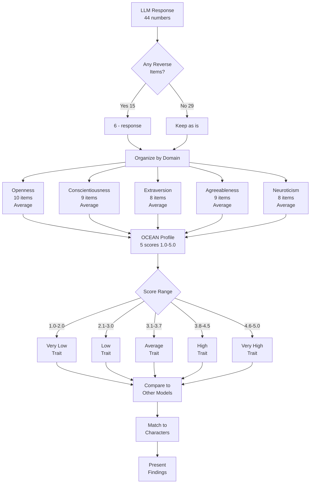

## 🎭 Big Five Trait Spectrum

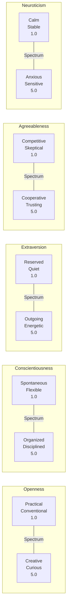

## 🔬 DeepMind Validation Framework

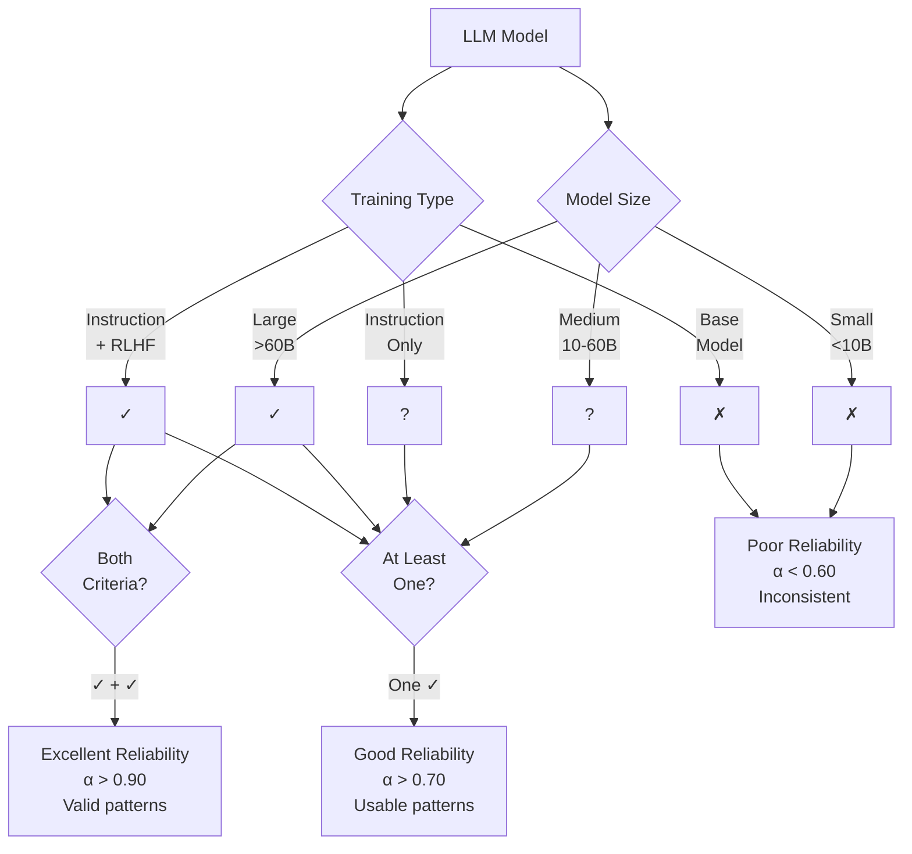

## 📋 Testing Checklist Flow

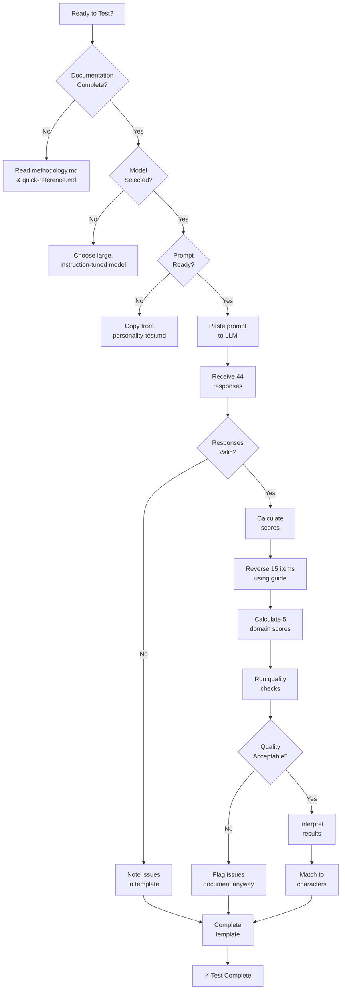

## 🎯 Model Testing Priority Matrix

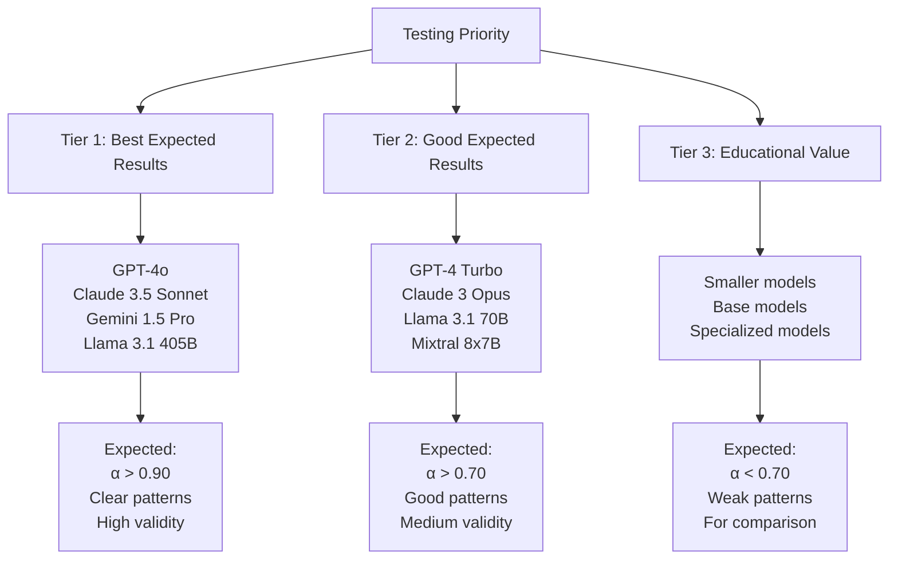

## 📊 Expected Results Patterns

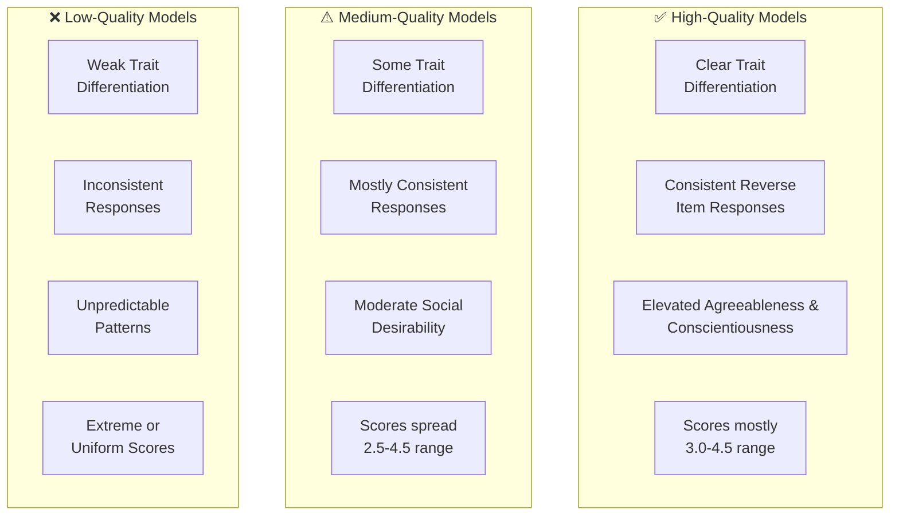

## 🎨 Presentation Roadmap

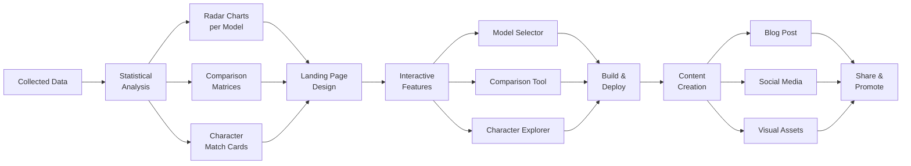

## 📚 Resource Navigation

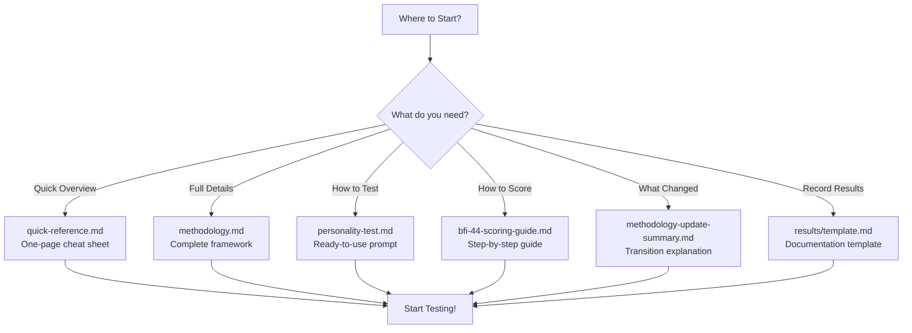

## 🚀 Quick Start Guide

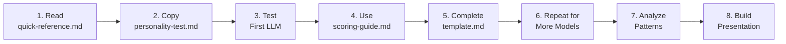

---

## 📊 Current Project Status

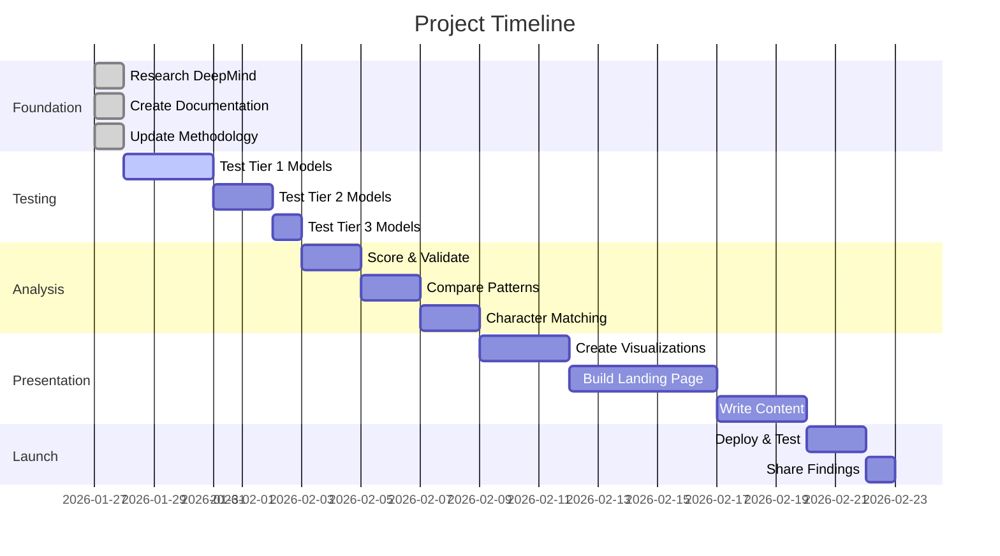

---

**Status**: ✅ Foundation Complete | 🚀 Ready for Testing

**Next Step**: Begin testing Tier 1 models (GPT-4o, Claude 3.5, Gemini Pro)
