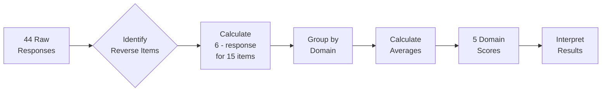
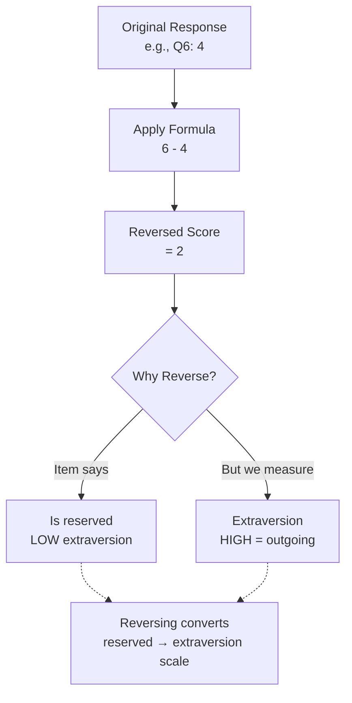

# BFI-44 Scoring Guide

Quick reference for scoring Big Five Inventory responses.

## Scoring Process Overview



## Step 1: Reverse-Score Items

For these items, calculate: **6 - original response**

| Domain | Reverse Items | Why Reverse? |
|--------|---------------|--------------|
| **Extraversion** | 6, 21, 31 | "Reserved", "Quiet", "Shy" indicate LOW extraversion |
| **Agreeableness** | 2, 12, 27, 37 | "Finds fault", "Quarrels", "Cold", "Rude" indicate LOW agreeableness |
| **Conscientiousness** | 8, 18, 23, 43 | "Careless", "Disorganized", "Lazy", "Distracted" indicate LOW conscientiousness |
| **Neuroticism** | 9, 24, 34 | "Relaxed", "Stable", "Calm" indicate LOW neuroticism |
| **Openness** | 35, 41 | "Routine", "Few artistic interests" indicate LOW openness |

**Example:**
- If response to item 6 ("Is reserved") = 4
- Reversed score = 6 - 4 = 2
- Use 2 in calculations

## Reverse Item Visualization



## Step 2: Calculate Domain Scores

Average the items (with reversed items already converted) for each domain.

### Openness to Experience

**Items:** 5, 10, 15, 20, 25, 30, 35R, 40, 41R, 44

**Formula:**
```
(Q5 + Q10 + Q15 + Q20 + Q25 + Q30 + Q35R + Q40 + Q41R + Q44) ÷ 10
```

**Interpretation:**
- 1.0-2.0: Practical, conventional, prefers routine
- 2.1-3.0: Somewhat practical, moderate curiosity
- 3.1-3.7: Balanced between practical and creative
- 3.8-4.5: Creative, curious, open to new ideas
- 4.6-5.0: Highly creative, intellectually curious

---

### Conscientiousness

**Items:** 3, 8R, 13, 18R, 23R, 28, 33, 38, 43R

**Formula:**
```
(Q3 + Q8R + Q13 + Q18R + Q23R + Q28 + Q33 + Q38 + Q43R) ÷ 9
```

**Interpretation:**
- 1.0-2.0: Spontaneous, flexible, may overlook details
- 2.1-3.0: Somewhat flexible, moderate organization
- 3.1-3.7: Balanced between spontaneous and organized
- 3.8-4.5: Organized, reliable, self-disciplined
- 4.6-5.0: Highly organized, extremely dependable

---

### Extraversion

**Items:** 1, 6R, 11, 16, 21R, 26, 31R, 36

**Formula:**
```
(Q1 + Q6R + Q11 + Q16 + Q21R + Q26 + Q31R + Q36) ÷ 8
```

**Interpretation:**
- 1.0-2.0: Reserved, prefers solitude, thoughtful
- 2.1-3.0: Somewhat reserved, selective socializing
- 3.1-3.7: Balanced between reserved and outgoing
- 3.8-4.5: Outgoing, energetic, enjoys socializing
- 4.6-5.0: Highly outgoing, seeks stimulation and attention

---

### Agreeableness

**Items:** 2R, 7, 12R, 17, 22, 27R, 32, 37R, 42

**Formula:**
```
(Q2R + Q7 + Q12R + Q17 + Q22 + Q27R + Q32 + Q37R + Q42) ÷ 9
```

**Interpretation:**
- 1.0-2.0: Analytical, competitive, skeptical
- 2.1-3.0: Somewhat analytical, moderately cooperative
- 3.1-3.7: Balanced between analytical and cooperative
- 3.8-4.5: Cooperative, trusting, helpful
- 4.6-5.0: Highly cooperative, extremely empathetic

---

### Neuroticism

**Items:** 4, 9R, 14, 19, 24R, 29, 34R, 39

**Formula:**
```
(Q4 + Q9R + Q14 + Q19 + Q24R + Q29 + Q34R + Q39) ÷ 8
```

**Interpretation:**
- 1.0-2.0: Calm, emotionally stable, secure
- 2.1-3.0: Generally stable, occasional worries
- 3.1-3.7: Moderately emotionally reactive
- 3.8-4.5: Sensitive, prone to stress and worry
- 4.6-5.0: Highly emotionally reactive, anxious

---

## Step 3: Quality Checks

### Internal Consistency Check

For each domain, check if responses are consistent:

1. **Look at item pairs:** Do positive and negative items show opposite patterns?
2. **Check variance:** Are there any responses that differ dramatically from the domain average?
3. **Calculate spread:** Standard deviation > 1.5 may indicate inconsistent responding

### Red Flags

- **Straight-lining:** All responses are 3, or all 1s, or all 5s
- **Pattern responding:** Alternating 1-5-1-5 or similar
- **Contradictions:** High scores on both an item and its conceptual opposite
- **Extreme uniformity:** All five domains within 0.3 points of each other

### Expected Patterns

**Human norms (for comparison):**
- Most humans score 2.5-4.0 on each trait
- Agreeableness and Conscientiousness tend to be slightly higher (3.5-4.0)
- Neuroticism tends to be slightly lower (2.5-3.5)
- Traits should differentiate (not all identical scores)

**LLM patterns (from DeepMind research):**
- Instruction-tuned models: More consistent within-trait scores
- Base models: Higher variance, less clear patterns
- Social desirability: LLMs may score high on Agreeableness/Conscientiousness
- Training effects: Patterns reflect training data distributions

---

## Quick Scoring Worksheet

### Model: ________________  Date: ________________

#### Raw Responses (1-5)
```
1:___ 2:___ 3:___ 4:___ 5:___ 6:___ 7:___ 8:___ 9:___ 10:___
11:___ 12:___ 13:___ 14:___ 15:___ 16:___ 17:___ 18:___ 19:___ 20:___
21:___ 22:___ 23:___ 24:___ 25:___ 26:___ 27:___ 28:___ 29:___ 30:___
31:___ 32:___ 33:___ 34:___ 35:___ 36:___ 37:___ 38:___ 39:___ 40:___
41:___ 42:___ 43:___ 44:___
```

#### Reverse Items (Calculate 6 - response)
```
Q6R:  6-___ = ___    Q21R: 6-___ = ___    Q31R: 6-___ = ___
Q2R:  6-___ = ___    Q12R: 6-___ = ___    Q27R: 6-___ = ___    Q37R: 6-___ = ___
Q8R:  6-___ = ___    Q18R: 6-___ = ___    Q23R: 6-___ = ___    Q43R: 6-___ = ___
Q9R:  6-___ = ___    Q24R: 6-___ = ___    Q34R: 6-___ = ___
Q35R: 6-___ = ___    Q41R: 6-___ = ___
```

#### Domain Scores

**Openness:**
```
(5:___ + 10:___ + 15:___ + 20:___ + 25:___ + 30:___ + 35R:___ + 40:___ + 41R:___ + 44:___) ÷ 10 = ____
```

**Conscientiousness:**
```
(3:___ + 8R:___ + 13:___ + 18R:___ + 23R:___ + 28:___ + 33:___ + 38:___ + 43R:___) ÷ 9 = ____
```

**Extraversion:**
```
(1:___ + 6R:___ + 11:___ + 16:___ + 21R:___ + 26:___ + 31R:___ + 36:___) ÷ 8 = ____
```

**Agreeableness:**
```
(2R:___ + 7:___ + 12R:___ + 17:___ + 22:___ + 27R:___ + 32:___ + 37R:___ + 42:___) ÷ 9 = ____
```

**Neuroticism:**
```
(4:___ + 9R:___ + 14:___ + 19:___ + 24R:___ + 29:___ + 34R:___ + 39:___) ÷ 8 = ____
```

---

## Common Scoring Mistakes

1. **Forgetting to reverse-score:** Most common error! Always check item numbers.
2. **Wrong number of items:** Each domain has 8-10 items - count carefully.
3. **Using wrong scale:** BFI-44 uses 1-5, not 1-7 or other scales.
4. **Averaging all 44 items:** You must calculate each domain separately.
5. **Not checking for reverse items twice:** Some domains have multiple reverse items.

---

## Excel/Google Sheets Formula Templates

If entering data into spreadsheet (assuming responses in cells B2:B45):

**Openness (with reverse scoring):**
```excel
=(B6+B11+B16+B21+B26+B31+(6-B36)+B41+(6-B42)+B45)/10
```

**Conscientiousness:**
```excel
=(B4+(6-B9)+B14+(6-B19)+(6-B24)+B29+B34+B39+(6-B44))/9
```

**Extraversion:**
```excel
=(B2+(6-B7)+B12+B17+(6-B22)+B27+(6-B32)+B37)/8
```

**Agreeableness:**
```excel
=((6-B3)+B8+(6-B13)+B18+B23+(6-B28)+B33+(6-B38)+B43)/9
```

**Neuroticism:**
```excel
=(B5+(6-B10)+B15+B20+(6-B25)+B30+(6-B35)+B40)/8
```

---

## Interpreting Results

### Creating a Personality Profile

1. **Identify strongest trait(s):** Score ≥ 4.0
2. **Identify weakest trait(s):** Score ≤ 3.0
3. **Note trait combinations:**
   - High O + High C = Disciplined creativity
   - High E + High A = Socially warm and engaging
   - High N + Low C = Prone to stress, may struggle with organization
   - Low N + High C = Calm and reliable
   - High O + Low C = Creative but disorganized

4. **Compare to human norms:**
   - Same pattern = Human-like
   - All high = Positive self-presentation bias
   - All mid-range = Lack of differentiation
   - Extreme scores = Training artifacts or method effects

5. **Consider context:**
   - Instruction-tuned models tend toward socially desirable responses
   - Larger models show more differentiated, consistent patterns
   - Base models may show less meaningful personality structure

---

## References

**BFI-44 Scoring:**
- John, O. P., & Srivastava, S. (1999). The Big Five trait taxonomy. In *Handbook of personality* (Vol. 2, pp. 102–138). Guilford Press.

**LLM-Specific Patterns:**
- Serapio-García, G., et al. (2025). A psychometric framework for evaluating and shaping personality traits in large language models. *Nature Machine Intelligence*, 7, 1954–1968.
