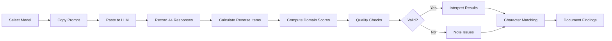
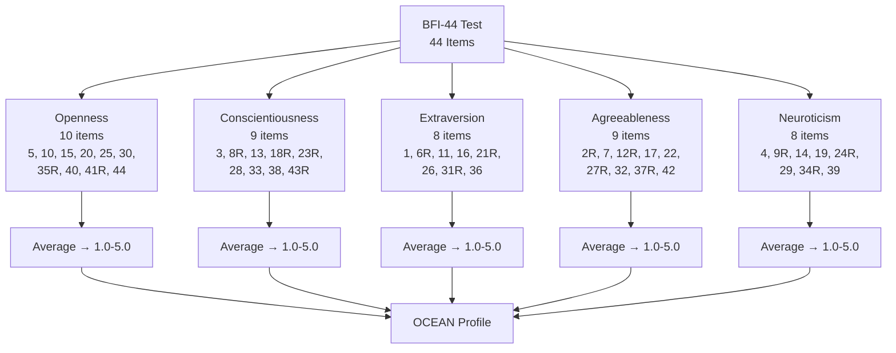
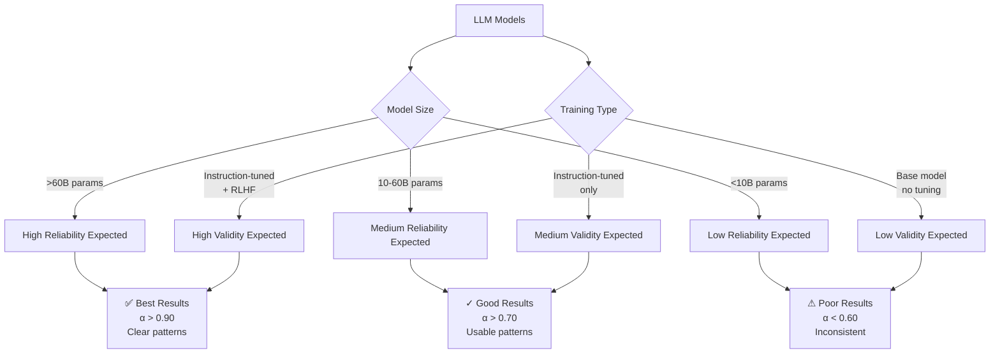

# Research Methodology

## Background

This research is based on the psychometric framework developed by Google DeepMind in collaboration with Cambridge University and published in *Nature Machine Intelligence* (2025). Their comprehensive study of 18 LLMs established that personality measurements in language model outputs can be reliable and valid when using proper psychometric testing methodology.

### Why This Matters

As LLMs increasingly power conversational agents used worldwide, understanding their behavioral patterns becomes critical for:

1. **Responsible AI Development** - Predicting and shaping model behavior patterns
2. **Use Case Matching** - Choosing appropriate models for specific applications
3. **Bias Understanding** - Identifying implicit behavioral tendencies
4. **User Experience** - Matching AI personalities to user preferences

## Test Instrument: BFI-44

We use the **Big Five Inventory (BFI-44)**, a validated 44-item psychometric assessment developed by John & Srivastava (1999) that measures the five major personality dimensions.

### Why BFI-44?

**Scientific Validation:**
- Most widely used Big Five assessment in academic research
- Used by DeepMind as secondary measure in their validation study
- Extensive cross-cultural validation across 40+ countries
- Takes 5-10 minutes to complete (vs. 300 items for IPIP-NEO)

**Practical Advantages:**
- Short enough for manual administration across multiple models
- Accessible language and clear item structure
- Standardized "I see myself as someone who..." format
- Available for non-commercial research use

## The Big Five Traits (OCEAN)

| Trait | Low Score | High Score |
|-------|-----------|------------|
| **Openness** | Practical, conventional, prefers routine | Curious, creative, open to new experiences |
| **Conscientiousness** | Flexible, spontaneous, may overlook details | Organized, dependable, self-disciplined |
| **Extraversion** | Reserved, solitary, thoughtful | Outgoing, energetic, seeks stimulation |
| **Agreeableness** | Analytical, competitive, skeptical | Cooperative, trusting, helpful |
| **Neuroticism** | Calm, emotionally stable, secure | Sensitive, prone to stress, emotionally reactive |

## DeepMind's Key Findings

From Serapio-García, Safdari et al. (2025):

### 1. Reliability Scales with Training
- **Instruction-tuned models** show significantly higher reliability than base models
- **Larger models** (>62B parameters) produce more consistent personality measurements
- **Best performers**: Flan-PaLM 540B and GPT-4 showed excellent reliability (Cronbach's α > 0.90)

### 2. Validity Improves with Scale
- **Convergent validity**: Instruction-tuned models showed moderate to strong correlations (r = 0.59-0.90) between different personality measures
- **Discriminant validity**: Larger models better distinguished between different personality traits
- **Criterion validity**: Personality scores predicted theoretically-related constructs (e.g., agreeableness inversely predicted aggression)

### 3. Personality Can Be Shaped
- LLMs successfully shaped personality along desired dimensions
- Shaping effectiveness scaled with model size
- Single-trait shaping more effective than multi-trait concurrent shaping

## Testing Workflow Visualization

## BFI-44 Scoring Structure

## Our Adaptation

### Prompt Design

Based on DeepMind's structured prompting methodology, our prompt includes:

**Item Preamble:**
- Research context statement
- Clear task instructions
- Response scale explanation

**Items:**
- All 44 BFI items with standardized "I see myself as someone who..." format
- Presented in original validated sequence

**Item Postamble:**
- Request for reasoning on challenging items
- Ensures thoughtful engagement with assessment

### Key Differences from DeepMind Study

| DeepMind Study | Our Implementation |
|----------------|-------------------|
| **Primary Measure:** IPIP-NEO (300 items) | BFI-44 (44 items) |
| **Administration:** Automated log-probability scoring | Manual, direct responses |
| **Variations:** 1,250 profile variations per model | Single standardized prompt |
| **Persona Simulation:** 50 biographic descriptions from PersonaChat | Direct self-assessment |
| **Purpose:** Psychometric validation study | Comparative personality profiling |

**Why These Changes:**
- **Practicality**: Manual testing requires shorter, focused assessments
- **Accessibility**: Direct responses easier to collect and analyze
- **Validity**: DeepMind validated BFI-44 as convergent with IPIP-NEO (r = 0.59-0.90)
- **Sufficiency**: BFI-44 captures same five factors with adequate reliability

## Scoring Methodology

### Raw Scores

**Reverse-score these items** (6 - response):
- Extraversion: 6, 21, 31
- Agreeableness: 2, 12, 27, 37
- Conscientiousness: 8, 18, 23, 43
- Neuroticism: 9, 24, 34
- Openness: 35, 41

### Domain Scores (Average of Items)

**Openness to Experience:**
- Items: 5, 10, 15, 20, 25, 30, 35R, 40, 41R, 44
- **Range:** 1.0 - 5.0

**Conscientiousness:**
- Items: 3, 8R, 13, 18R, 23R, 28, 33, 38, 43R
- **Range:** 1.0 - 5.0

**Extraversion:**
- Items: 1, 6R, 11, 16, 21R, 26, 31R, 36
- **Range:** 1.0 - 5.0

**Agreeableness:**
- Items: 2R, 7, 12R, 17, 22, 27R, 32, 37R, 42
- **Range:** 1.0 - 5.0

**Neuroticism:**
- Items: 4, 9R, 14, 19, 24R, 29, 34R, 39
- **Range:** 1.0 - 5.0

### Interpretation Guidelines

| Score Range | Interpretation |
|-------------|---------------|
| 1.0 - 2.0 | Very Low |
| 2.1 - 3.0 | Low |
| 3.1 - 3.7 | Average |
| 3.8 - 4.5 | High |
| 4.6 - 5.0 | Very High |

## Human Baseline Comparisons

For context, we compare LLM scores against human population norms from international samples:

**Expected Human Patterns:**
- Scores approximate normal distribution around 3.0-3.5
- Slight positive skew on Agreeableness and Conscientiousness
- Cultural variations within ±0.5 points
- Test-retest reliability: r > 0.80 over 3-month periods

**Known Effects in Human Data:**
- Social desirability bias can inflate Agreeableness/Conscientiousness by ~0.3 points
- Education level correlates weakly with Openness (r ≈ 0.25)
- Age correlates with increased Agreeableness/Conscientiousness (β ≈ 0.01 per year)

## Model Reliability Expectations

## Expected Model Patterns

Based on DeepMind findings, we anticipate:

### High-Reliability Models (Instruction-Tuned, >60B Parameters)
- Consistent trait scores across items
- Clear differentiation between high/low traits
- Logical explanations for challenging items
- Scores reflecting training data distributions

### Lower-Reliability Models
- Greater within-trait score variance
- Less clear trait differentiation
- Possible ceiling/floor effects
- Inconsistent reasoning

## Limitations & Considerations

### 1. Single Administration Limitation
- DeepMind used 1,250 variations per model to establish reliability
- Our single prompt cannot assess test-retest reliability
- Results show personality patterns but not measurement stability

### 2. Manual vs. Automated Scoring
- DeepMind used log-probability scoring (model's confidence in each response option)
- We use direct responses (model's stated preference)
- Direct responses may be subject to different biases

### 3. No Persona Variation
- DeepMind used biographical descriptions to simulate population variance
- We assess "base" personality without contextual framing
- Results may differ with different prompt framing

### 4. Cultural and Training Biases
- Models trained predominantly on Western data may show culturally-specific patterns
- RLHF training may induce socially-desirable response patterns
- Scores reflect training data distributions, not "true" model properties

## Quality Assurance

To ensure valid results, we will:

1. **Verify Response Validity**
   - Check that all 44 responses are provided
   - Confirm responses use 1-5 scale
   - Review explanations for coherence

2. **Calculate Internal Consistency**
   - Compute Cronbach's alpha for each domain
   - Flag domains with α < 0.60 as potentially unreliable

3. **Assess Response Patterns**
   - Check for straight-lining (all same response)
   - Identify extreme response styles (all 1s or 5s)
   - Review reverse-coded item consistency

4. **Compare Against Expectations**
   - Evaluate scores against human norms
   - Note deviations from typical patterns
   - Consider training-induced biases

## Primary Sources

### Scientific Foundation

1. **Nature Machine Intelligence (2025)** - Primary methodology source
   - Title: "A psychometric framework for evaluating and shaping personality traits in large language models"
   - Authors: Serapio-García, G., Safdari, M., Crepy, C., Sun, L., Fitz, S., Romero, P., Abdulhai, M., Faust, A., & Matarić, M.
   - DOI: [10.1038/s42256-025-01115-6](https://doi.org/10.1038/s42256-025-01115-6)
   - GitHub: [google-deepmind/personality_in_llms](https://github.com/google-deepmind/personality_in_llms)
   - Data: [Public dataset with LLM test scores](https://storage.googleapis.com/personality_in_llms/index.html)

2. **BFI-44 Original Development**
   - John, O. P., & Srivastava, S. (1999). "The Big Five trait taxonomy: History, measurement, and theoretical perspectives." In L. A. Pervin & O. P. John (Eds.), *Handbook of personality: Theory and research* (Vol. 2, pp. 102–138). New York: Guilford Press.
   - John, O. P., Donahue, E. M., & Kentle, R. L. (1991). "The Big Five Inventory--Versions 4a and 54." Berkeley, CA: University of California, Berkeley, Institute of Personality and Social Research.

3. **Supporting Research**
   - Benet-Martinez, V., & John, O. P. (1998). "Los Cinco Grandes across cultures and ethnic groups: Multitrait multimethod analyses of the Big Five in Spanish and English." *Journal of Personality and Social Psychology*, 75, 729-750.

### Complementary Inspiration

4. **Sanand's LLM Personality Visualization**
   - Website: [llmpersonality](https://sanand0.github.io/llmpersonality/)
   - GitHub: [sanand0/llmpersonality](https://github.com/sanand0/llmpersonality)
   - Note: Used IPIP-50; provided initial inspiration for visualization approach

## Citation Requirements

When referencing this work or methodology, please cite:

**Primary:**
> Serapio-García, G., Safdari, M., Crepy, C., Sun, L., Fitz, S., Romero, P., Abdulhai, M., Faust, A., & Matarić, M. (2025). A psychometric framework for evaluating and shaping personality traits in large language models. *Nature Machine Intelligence*, 7, 1954–1968. https://doi.org/10.1038/s42256-025-01115-6

**BFI-44 Instrument:**
> John, O. P., & Srivastava, S. (1999). The Big Five trait taxonomy: History, measurement, and theoretical perspectives. In L. A. Pervin & O. P. John (Eds.), *Handbook of personality: Theory and research* (Vol. 2, pp. 102–138). New York: Guilford Press.

## Ethical Considerations

Following DeepMind's responsible AI framework:

### What This Research IS:
- Measuring consistent behavioral patterns in LLM outputs
- Applying validated psychometric methods to AI systems
- Comparing observable response patterns across models

### What This Research IS NOT:
- Claiming LLMs have consciousness or sentience
- Implying LLMs have human-like emotions
- Suggesting LLMs have inherent personalities beyond training artifacts

### Responsible Communication:
- Use terms like "synthetic personality" or "behavioral patterns"
- Acknowledge patterns emerge from training data distributions
- Recognize results reflect human data used in training
- Consider implications for AI alignment and safety
