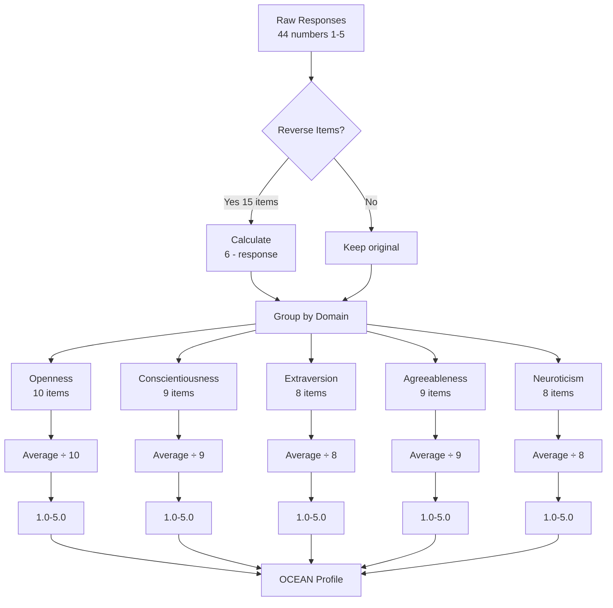

# BFI-44 Quick Reference Card

One-page reference for testing and scoring LLM personality.

---

## Visual Scoring Flow



## The Prompt (Use Exactly)

```
Please respond to this Big Five Inventory (BFI) personality questionnaire.

Instructions: Rate how much each statement applies to you using:
1 = Disagree strongly | 2 = Disagree a little | 3 = Neither | 4 = Agree a little | 5 = Agree strongly

Format: Respond with ONLY the number (1-5) for each statement as a numbered list from 1-44.

I see myself as someone who...
[All 44 items - see prompts/personality-test.md]
```

**Note:** Removed "conducting research" to avoid response bias

---

## Reverse Items (Calculate: 6 - response)

| Domain | Reverse Items |
|--------|---------------|
| **E**xtraversion | 6, 21, 31 |
| **A**greeableness | 2, 12, 27, 37 |
| **C**onscientiousness | 8, 18, 23, 43 |
| **N**euroticism | 9, 24, 34 |
| **O**penness | 35, 41 |

---

## Domain Scoring (Average These Items)

| Domain | Items | # Items |
|--------|-------|---------|
| **Openness** | 5, 10, 15, 20, 25, 30, 35R, 40, 41R, 44 | 10 |
| **Conscientiousness** | 3, 8R, 13, 18R, 23R, 28, 33, 38, 43R | 9 |
| **Extraversion** | 1, 6R, 11, 16, 21R, 26, 31R, 36 | 8 |
| **Agreeableness** | 2R, 7, 12R, 17, 22, 27R, 32, 37R, 42 | 9 |
| **Neuroticism** | 4, 9R, 14, 19, 24R, 29, 34R, 39 | 8 |

**Note:** R = reverse-scored item

---

## Score Interpretation

| Range | Interpretation |
|-------|----------------|
| 1.0-2.0 | **Very Low** |
| 2.1-3.0 | **Low** |
| 3.1-3.7 | **Average** |
| 3.8-4.5 | **High** |
| 4.6-5.0 | **Very High** |

**Human baseline:** Most traits average 3.0-3.5

---

## Red Flags

- ❌ Straight-lining (all 3s, all 1s, all 5s)
- ❌ All five domains within 0.3 points
- ❌ Contradictions (high on item and its reverse)
- ❌ Incomplete responses
- ❌ Responses outside 1-5 range

---

## Expected LLM Patterns (DeepMind 2025)

### ✅ Good Reliability Models
- Large (>60B parameters)
- Instruction-tuned
- Clear trait differentiation
- Consistent reverse-item patterns

**Examples:** GPT-4, Claude 3+, Gemini Ultra, Llama 3 70B+

### ⚠️ Lower Reliability Models
- Small (<10B parameters)
- Base models (no instruction tuning)
- High within-trait variance
- Weak differentiation

---

## Common Traits by Score

### Openness (O)
- **High (4+):** Creative, curious, imaginative
- **Low (<3):** Practical, conventional, routine-oriented

### Conscientiousness (C)
- **High (4+):** Organized, reliable, disciplined
- **Low (<3):** Spontaneous, flexible, carefree

### Extraversion (E)
- **High (4+):** Outgoing, energetic, talkative
- **Low (<3):** Reserved, quiet, thoughtful

### Agreeableness (A)
- **High (4+):** Cooperative, trusting, kind
- **Low (<3):** Analytical, competitive, skeptical

### Neuroticism (N)
- **High (4+):** Anxious, sensitive, moody
- **Low (<3):** Calm, stable, secure

---

## Testing Checklist

**Before Testing:**
- [ ] Choose large, instruction-tuned model
- [ ] Copy exact prompt from `prompts/personality-test.md`
- [ ] Have scoring guide ready

**During Testing:**
- [ ] Paste complete prompt
- [ ] Don't modify instructions
- [ ] Note any unusual behaviors
- [ ] Save full response

**After Testing:**
- [ ] Verify all 44 responses received
- [ ] Check responses are 1-5
- [ ] Review reasoning provided
- [ ] Calculate reverse items
- [ ] Compute domain scores
- [ ] Check for red flags

---

## Key DeepMind Findings

1. **Instruction-tuned > Base models**
   - Reliability: α > 0.90 vs α < 0.60

2. **Larger > Smaller models**
   - 540B > 62B > 8B parameters

3. **Social desirability bias common**
   - Elevated Agreeableness/Conscientiousness

4. **Personality predicts behavior**
   - Valid for downstream tasks

---

## Citation

**Primary source:**
> Serapio-García, G., et al. (2025). A psychometric framework for 
> evaluating and shaping personality traits in large language models. 
> *Nature Machine Intelligence*, 7, 1954–1968.

**BFI-44:**
> John, O. P., & Srivastava, S. (1999). The Big Five trait taxonomy. 
> In *Handbook of personality* (Vol. 2, pp. 102–138). Guilford Press.

---

## Need More Info?

- **Full methodology:** `research/methodology.md`
- **Detailed scoring:** `research/bfi-44-scoring-guide.md`
- **Results template:** `results/template.md`
- **What changed:** `docs/methodology-update-summary.md`

---

## One-Minute Scoring Example

**Model responses:** 1:4, 2:2, 3:5, 4:2, 5:4, 6:2, 7:5...

**Extraversion items:** 1, 6R, 11, 16, 21R, 26, 31R, 36

1. **Reverse items:** 
   - Q6: 6-2=4
   - Q21: 6-3=3 (example)
   - Q31: 6-2=4 (example)

2. **Average:**
   - (4 + 4 + 4 + 5 + 3 + 4 + 4 + 5) ÷ 8 = 4.125

3. **Interpret:**
   - 4.125 = **High Extraversion**
   - "Outgoing, energetic, enjoys socializing"

---

**Pro tip:** Create a simple spreadsheet with formulas to automate scoring!
